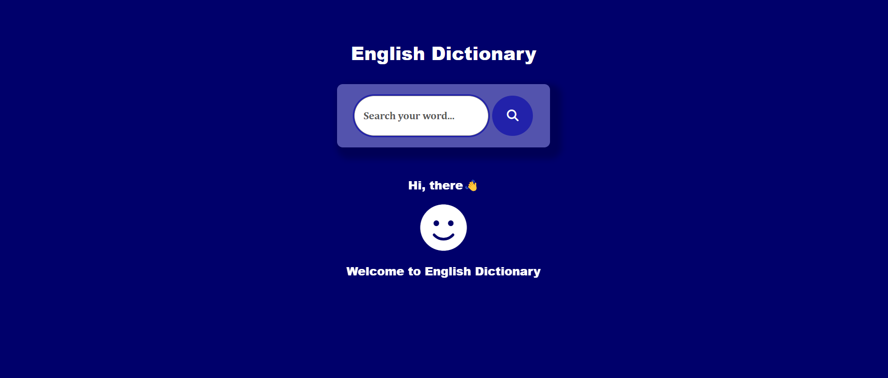
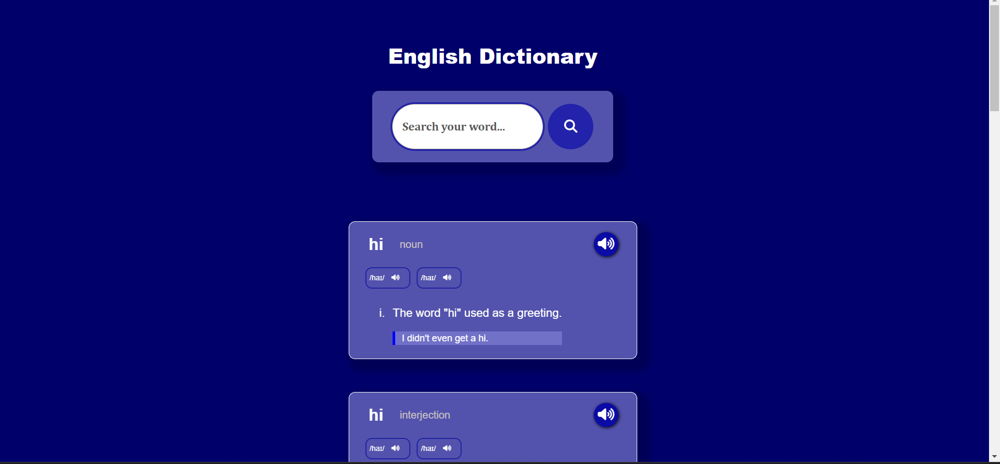

# English Dictionary Website

Welcome to the English Dictionary Website! This web-based dictionary provides users with word definitions, phonetic sounds, meanings, and example phrases.

## Features

- **Word Search:** Enter a word and get information about its pronunciation, meaning, and usage.
- **Phonetic Sound:** Listen to the phonetic pronunciation of the searched word.
- **Example Phrases:** Explore example phrases to understand how the word is used in context.

## Technologies Used

- **HTML:** Structure of the webpage.
- **CSS:** Styling and layout.
- **JavaScript:** Handling user interactions and API calls.

## How to Use

1. **Clone the repository to your local machine:**

   ```bash
   git clone https://github.com/Abhishek111883/Dictionary-website.git
2. **Open the Website:**

    Open the `index.html` file in your web browser.

3. **Search for a Word:**

    Enter a word in the search bar and click the search button or press Enter.

4. **Explore Information:**

    Explore the provided information, including the phonetic sound, meaning, and example phrases for the searched word.

## Screenshots

**Figure 1: Homepage of the English Dictionary Website**



**Figure 2: Search result for the word "example"**



## Dependencies

- [FontAwesome](https://fontawesome.com/): Icons for features like audio playback.

## API Used

The dictionary website fetches word information from the [DictionaryAPI](https://dictionaryapi.dev/). Ensure you have an internet connection to access the API.

## Contributions

Contributions are welcome! If you have any improvements or feature suggestions, feel free to open an issue or submit a pull request.
